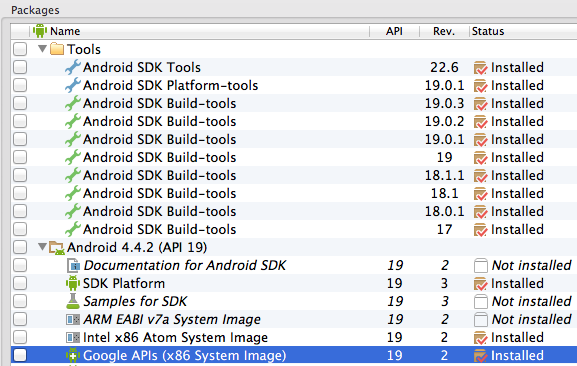
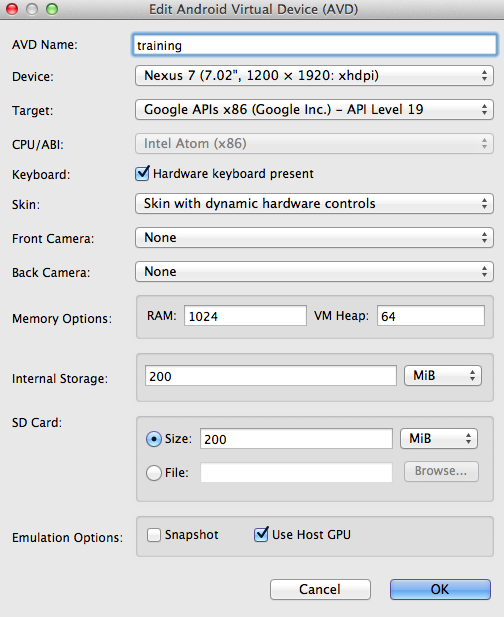

## Install Android

The following instructions are specific to installing Android on OS X.

### Bash Profile

- Add the Android SDK tools folder to your path so you can run `android`.
- Define the `ANDROID_HOME` env var pointing to SDK root. On OS X place it in
`~/.bash_profile`
- You may have to add grunt as well `/usr/local/share/npm/bin/grunt`

<code>
# ~/.bash_profile
export ANDROID_HOME=$HOME/Downloads/android-sdk-macosx
export ANDROID_SDK=$ANDROID_HOME
PATH=$PATH:/Applications/apache-ant-1.8.4/bin
PATH=$PATH:/usr/local/share/npm/bin/
PATH=$PATH:$ANDROID_HOME/build-tools
PATH=$PATH:$ANDROID_HOME/platform-tools
PATH=$PATH:$ANDROID_HOME/tools
export JAVA_HOME="`/System/Library/Frameworks/JavaVM.framework/Versions/Current/Commands/java_home`"

export PATH
</code>

- Run `android` to open the SDK manager.
- Install the following packages:

- Create a new Android virtual device.
Ensure `Use Host GPU` is checked.
Set `VM Heap` to `64`. `32` is too small.

`android avd`

- Launch the emulator with `emulator @tutorial`

- Check that `hax is working` If it's not, install hax
[directly from Intel](http://software.intel.com/en-us/articles/intel-hardware-accelerated-execution-manager)

<code>
$ emulator @tutorial
HAX is working and emulator runs in fast virt mode
</code>

- After launching the emulator, check that it's listed in adb devices. Run
the following commands a few times until it's listed.

`adb kill-server; adb devices`

If you see `error: protocol fault (no status)` just keep running the command
until the emulator is detected.

- With both the Android emulator running and the Appium server started, it's
time to launch the appium console. Make sure the ENV vars are exported.

- Start appium console

`arc`

- See [running on OS X](https://github.com/appium/appium/blob/master/docs/running-on-osx.md)