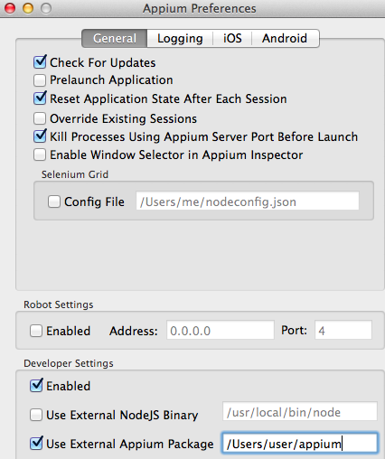

# Getting started with appium


## Introduction

Appium enables iOS and Android automation using Selenium WebDriver.
The same WebDriver bindings can be used across web and mobile.

- Open Source
  - Apache 2.0 License
- Cross Platform
  - Test Android on OS X, Windows, Linux
  - Test iOS on OS X
- Native, Hybrid, Mobile Web
- Any language. Any framework.
- No app changes or source code access required.


In this chapter, we'll be preparing to automate a native iOS application.


## Install Overview

This document is written for OS X 10.9.2 or better.

   Tool | Description
     --:|:--
OS X    | The mac operating system
Xcode   | Apple's integrated development environment
rvm     | The ruby version manager. Helps install ruby
gem     | The rubygems command. A package manager for Ruby
Java    | A programming language and software development kit
bundler | Enables managing gem dependencies
brew    | Helps install software on Macs
npm     | Node's package manager
grunt   | A command line task runner for node.js
ant     | A java build system
maven   | A java build system with improved dependency management

Note that [Appium.app](http://appium.io/) provides a ready to run version of
appium. If you're using Appium.app then there's no need to run from source unless
you want to use the latest and greatest.

Install [Xcode 5.1 from the App Store](https://developer.apple.com/downloads/index.action).

Install the command line build tools within Xcode. (Xcode -> Preferences -> Downloads).
Alternatively, download them directly from [Apple](https://developer.apple.com/downloads/index.action).

- Install [Java 7](http://www.oracle.com/technetwork/java/javase/downloads/index.html).

## Install Ruby

- Install the latest stable release of Ruby.

<code>\curl -sSL https://get.rvm.io | bash -s stable
rvm install ruby
</code>

- Make sure RVM is using the correct Ruby by default

<code>rvm list
rvm --default use 2.1.1
</code>

- If you have an old ruby/rvm, you can upgrade with

<code>rvm get head
rvm autolibs homebrew
rvm install ruby
</code>

- Check that it's installed properly by printing the ruby version.

`ruby --version`

- Update RubyGems and Bundler.

<code>gem update --system
gem install --no-rdoc --no-ri bundler
gem update
gem cleanup
</code>

- Check that RubyGems is >= 2.1.5

`gem --version`

- Install `appium_console` gem.

<code>gem uninstall -aIx appium_lib
gem uninstall -aIx appium_console
gem install --no-rdoc --no-ri appium_console
</code>

- Install [flaky](https://github.com/appium/flaky) gem.

<code>gem uninstall -aIx flaky
gem install --no-rdoc --no-ri flaky
</code>

- Install [brew](http://mxcl.github.io/homebrew/)

`ruby -e "$(curl -fsSL https://raw.github.com/Homebrew/homebrew/go/install)"`

- Install [nodejs](http://nodejs.org/) using brew.

<code>brew update
brew upgrade node
brew install node
</code>

- Node should be `v0.10.26` or better.
Don't use the big green install button on [nodejs.org](http://nodejs.org/) or
all npm commands will require sudo.

<code>node --version
npm --version
</code>

- Install grunt.

`npm install -g grunt grunt-cli`

- Run the version command from the appium folder. If you're not in that
folder, the grunt version will not display.

<code>grunt --version
grunt-cli v0.1.13
grunt v0.4.2
</code>

- Install [ant](http://ant.apache.org/) if it's not already installed.
- Install [maven 3.1.1 or better](http://maven.apache.org/download.cgi) if
it's not already installed. Old maven will not work.

<code>ant -version
mvn -version
</code>

- Clone appium

`git clone git://github.com/appium/appium.git`

- Run reset.sh. When running reset.sh, make sure to be on Xcode 5.0.2 for
best results. You may have problems if you reset on Xcode 4.6.3 and then
switch to a newer Xcode.

`cd appium; ./reset.sh`

If you see config errors, try cleaning git. `git clean -dfx; git reset --hard`

You can also reset by platform. `./reset.sh --ios`

- Authorize for testing. Must run reset.sh as mentioned above before
running the grunt task. If you're only testing Android, this can be skipped.

`sudo \`which grunt\` authorize`

- Start appium.

`$ node .`

## Bash Profile

- You may have to add grunt as well `/usr/local/share/npm/bin/grunt`

<code>$ nano ~/.bash_profile
PATH=$PATH:/Applications/apache-ant-1.8.4/bin
PATH=$PATH:/usr/local/share/npm/bin/
export JAVA_HOME="`/System/Library/Frameworks/JavaVM.framework/Versions/Current/Commands/java_home`"

export PATH
</code>

## Troubleshooting

- If install fails, keep trying to install a few times.

When using `Appium.app` make sure to set Appium -> Preferences... -> Check
"Use External Appium Package" and set it to the path of Appium cloned from GitHub.

Fix permission errors. npm shouldn't require sudo.

<code>brew uninstall node
brew install node
rm -rf ./node_modules
rm -rf "/Users/`whoami`/.npm"
rm -rf /usr/local/lib/node_modules/
./reset.sh --ios
./reset.sh --android
</code>

- [Helper bash methods](https://gist.github.com/bootstraponline/5580587)

## SSL Issues

> Unable to download data from https://rubygems.org/ - SSL_connect returned=1 errno=0 state=SSLv3 read server certificate B: certificate verify failed

- [Fix SSL issues](http://railsapps.github.io/openssl-certificate-verify-failed.html) with:

<code>rvm osx-ssl-certs update all
rvm osx-ssl-certs status all
</code>

## Maven on OS X 10.9

<code>brew update
brew install maven
</code>

## Corrupt ruby gems

If you see:

`invalid gem: package is corrupt, exception while verifying: undefined method`

Then run `rm -rf ~/.rvm` and reinstall RVM.


## Ruby IDE

I recommend the [RubyMine IDE](http://www.jetbrains.com/ruby/whatsnew/index.html).
For professional work, features such as auto completion, jump to definition,
and refactoring are valuable.

If you have a preferred editor already, then feel free to continue using it.


## Java IDE

Java has a number of popular editors. For this module,
we'll be using `IntelliJ IDEA Community Edition`, an open source IDE by
JetBrains. The software is available [for free download at this link](http://www.jetbrains.com/idea/download/).

If you already have a preferred editor, feel free to continue using it.


## Helpful Links

Link | Summary
  --:|:--
[npm][npm]           | The main registry for npm packages. Appium is published here.
[rubygems][rubygems] | The main registry for Ruby gems. The appium ruby bindings are published here.
[RVM][rvm]           | RVM's homepage. Extensive documentation is available.
[Ruby][ruby]         | The Ruby language homepage. Useful for keeping up to date with Ruby releases.

[npm]:      https://www.npmjs.org/
[rubygems]: http://rubygems.org/
[rvm]:      http://rvm.io/
[ruby]:     https://www.ruby-lang.org/en/


## Summary

We learned about the appium project and how it's useful for automating mobile
applications. Then we installed all the necessary software to begin
automation. Finally, helpful links were reviewed.

In the next chapter, we'll look at writing tests interactively using a console.


# Appium Ruby Console

## Introduction

A read-eval-print loop, REPL, is a great way to learn a new technology.
In this chapter, we'll be using the Appium Ruby Console (ARC) to write tests.

An open source mobile app will be used to demonstrate the standard test workflow.
We'll also look at a desktop app that makes writing tests a bit easier.


## Compiling the iOS sample app

`cd` into the appium repository root. Running `./reset.sh --ios --dev` will
 build the sample iOS app UICatalog.

The UICatalog app is [provided by Apple](https://developer.apple.com/library/ios/samplecode/UICatalog/UICatalog.zip).

After seeing `---- reset.sh completed successfully ----`, you'll find `UICatalog.app`
at this location:

> /appium/sample-code/apps/UICatalog/build/Release-iphonesimulator/UICatalog.app

It's important to note that this app is built for the simulator.
Builds for physical iOS devices only work on physical iOS devices.

Appium supports physical devices however this tutorial focuses
on virtual devices.


## Prebuilt iOS Sample App

To make it easier to get started, I've uploaded a prebuilt version of the
iOS sample app. If for some reason this app doesn't work on your system, you
may need to build from source. Instructions for building the sample app from
source are in the previous lesson.

UICatalog.app is available [as a zip](https://github.com/appium/ruby_lib/raw/master/ruby_lib_ios/UICatalog.app.zip). I
recommend unzipping the app before using it with appium.


## Starting the Console

To start the Appium Ruby Console for use with iOS, the app path is required.

In this case we're developing locally, so let's create an appium.txt with
that path.

```
$ nano appium.txt
[caps]
platformName = "ios"
app = "./UICatalog.app"
```

The appium.txt contains two important pieces of information.

platformName is the platform we're automating. In this case,
we're going to automate ios.

app is the path to UICatalog.app. The ruby console is able to parse
relative paths. This path will then be converted to an absolute path which
appium uses to identify which app to install on the simulator.

In a new terminal tab, start the appium server using `node .` In a different
tab, run the `arc` command from within the directory containing appium.txt.
The arc console will read appium.txt, launch the iOS simulator,
and allow you to enter commands.


## Page Command

With the console started, the next step is to begin automation.
The `page` command prints a list of elements that are of interest.

```
[1] pry(main)> page
post /execute
{
    :script => "UIATarget.localTarget().frontMostApp().windows()[0].getTree()"
}
post /execute
{
    :script => "UIATarget.localTarget().frontMostApp().windows()[1].getTree()"
}
post /execute
{
    :script => "mobile: getStrings"
}
UIANavigationBar
   name: UICatalog
UIAStaticText
   name, label, value: UICatalog
UIATableView
   name, label: Empty list
   value: rows 1 to 10 of 12
UIATableCell
   name: Buttons, Various uses of UIButton
UIAStaticText
   name, label: Buttons, Various uses of UIButton
UIATableCell
   name: Controls, Various uses of UIControl
UIAStaticText
   name, label: Controls, Various uses of UIControl
UIATableCell
   name: TextFields, Uses of UITextField
UIAStaticText
   name, label: TextFields, Uses of UITextField
UIATableCell
   name: SearchBar, Use of UISearchBar
UIAStaticText
   name, label: SearchBar, Use of UISearchBar
UIATableCell
   name: TextView, Use of UITextField
UIAStaticText
   name, label: TextView, Use of UITextField
UIATableCell
   name: Pickers, Uses of UIDatePicker, UIPickerView
UIAStaticText
   name, label: Pickers, Uses of UIDatePicker, UIPickerView
UIATableCell
   name: Images, Use of UIImageView
UIAStaticText
   name, label: Images, Use of UIImageView
UIATableCell
   name: Web, Use of UIWebView
UIAStaticText
   name, label: Web, Use of UIWebView
UIATableCell
   name: Segment, Various uses of UISegmentedControl
UIAStaticText
   name, label: Segment, Various uses of UISegmentedControl
UIATableCell
   name: Toolbar, Uses of UIToolbar
UIAStaticText
   name, label: Toolbar, Uses of UIToolbar
```

Let's review in detail what this output means.

`[1] pry(main)> page` The 1 tells us this is the first command we've entered
during this pry session. The terminal will show `[2] pry(main)> ` which means
it's ready for the second command. Pry is an open source
[runtime development console](http://pryrepl.org/) that's used by appium
ruby console.

The next set of information is the network traffic.

```
{
    :script => "UIATarget.localTarget().frontMostApp().windows()[0].getTree()"
}
post /execute
{
    :script => "UIATarget.localTarget().frontMostApp().windows()[1].getTree()"
}
post /execute
{
    :script => "mobile: getStrings"
}
```

In response to the page command, three network requests were sent. The
[selenium-webdriver gem](http://rubygems.org/gems/selenium-webdriver) is used
to generate these requests.

After that is the result of the page command.

```
UIAStaticText
   name, label, value: UICatalog
```

`UIAStaticText` is the [iOS specific name](https://developer.apple.com/library/ios/documentation/ToolsLanguages/Reference/UIAStaticTextClassReference/UIAStaticText/UIAStaticText.html)
for the element.

Under each element name is a list of properties.

```
UIAStaticText
   name, label, value: UICatalog
```

In this case we see that the name, label, and value are all equal to UICatalog.

```
> name('UICatalog')
#<Selenium::WebDriver::Element:0x..f8575cfe515fb47ea id="0">
```

The name command in the appium ruby gem will search for a partial match on
either the name or the label. Once we've found the element,
then we can access the value attribute.

To find by value, we'd use:

```
> s_text 'UICatalog'
#<Selenium::WebDriver::Element:0x5e4e2159acc099a id="3">
```

This finds a static text that contains UICatalog. If we're looking for an
exact match, then s_text_exact works.

```
> s_text_exact 'UICatalog'
#<Selenium::WebDriver::Element:0x5e4e2159acc099a id="3">
```

These helper methods [are documented on GitHub](https://github.com/appium/ruby_lib/tree/master/docs).

To view all possible elements, there's a `source` command. The `page_class`
command will give you an overview of what classes exist on the current page.

```
> page_class
13x UIAStaticText
12x UIATableCell
4x UIAElement
3x UIAWindow
2x UIAImage
1x UIATableView
1x UIANavigationBar
1x UIAStatusBar
```

The page command excels at identifying the elements you're most likely
interested in automating. I encourage you to read through the existing docs
and try the methods on different elements.


## Ending the session

Once we're done with a testing session, it's very important to cleanly quit.
If a session is not terminated properly then appium will consider the session
to still be in progress. This blocks all future sessions from working.

In the appium ruby console, the best way to quit the session is by using the
`x` command. The `x` command first ends the webdriver session,
and then ends the console.

If you desire to end only the webdriver session and remain in the console,
use driver_quit.

It's also important to end sessions when running tests outside the console.
All the selenium bindings offer a quit method. This should be invoked once
the testing session is over.


## Appium.app Inspector

We've covered finding elements using the page command on the terminal.
Appium also has a GUI tool on OS X called Appium.app.

Appium.app enables visual exploration of the application to identify elements.
In addition, gestures are supported and can be exported to working code.

When using Appium.app for the first time, click the checkbox button. This
will activate appium doctor. If you don't see all green checkmarks,
then something is incorrect with your system configuration. Make the
necessary changes, press the checkbox button again, and then proceed when
everything is passing.


By default Appium.app uses a bundled version of appium. If you're running the
newest appium version from source, then click `Appium` -> `Preferences` and
set `Use External Appium Package`.



While most interactions can be done completely within the console, Appium.app is
great for identifying the proper values for appium's gesture commands.


Appium.app's inspector works on iOS. The data is based on the same source as
the page command that we used in the last lesson.


## Helpful Links

Link | Summary
  --:|:--
[Appium][appium]                     | New versions of Appium.app are available on the appium homepage.
[appium_lib gem][appium_lib]         | Appium's ruby library is on GitHub.
[appium_console gem][appium_console] | Appium's Ruby Console is also on GitHub.
[Selenium JsonWireProtocol][json]    | The network traffic displayed in the console conforms to the JSON Wire Protocol.

[appium]:         http://appium.io
[appium_lib]:     https://github.com/appium/ruby_lib
[appium_console]: https://github.com/appium/ruby_console
[json]:           https://code.google.com/p/selenium/wiki/JsonWireProtocol


## Summary

We covered using the ruby console to interactively explore apps and write
tests. An open source iOS app was used for testing. In addition to the terminal
workflow, we covered Appium.app which is an excellent visual based tool.


# Writing your first test

## Introduction

Now that we've looked at the commands in the console,
it's time to write our first test. This involves using a test framework,
following the page object pattern, and running the test automatically.


## Automating a simple action

```ruby
> The commands in the test are exactly the same as those used in the console.
Code can be copied and pasted to and from the console to form production tests.

> Clone the git repository and copy the [ruby_ios](https://github.com/appium/tutorial/tree/master/projects/ruby_ios)
directory to your computer.

> git clone https://github.com/appium/tutorial.git
```

```java
> The commands from the Ruby console are different from those in the Java
bindings. To make this easier, the java_ios folder contains a Helpers class.
Convenience methods such as s_text, back, and wait have been added. They're
generally intended to mimic the code we've looked at in the Ruby console.

> Clone the git repository and copy the [java_ios](https://github.com/appium/tutorial/tree/master/projects/java_ios)
directory to your computer.

> git clone https://github.com/appium/tutorial.git

> The project is setup using maven.

> - To use with NetBeans, go to `File` then `Open Project` and select the folder.
- To use with Eclipse, go to `File` then `Import` and select `Existing Maven Projects`
- To use with IntelliJ, go to `File` then `Open` and select the `pom.xml`
- To use with the command line, `mvn clean test` will run all the tests.
```

The basic structure of the UICatalog test app is that clicking on the text
brings you to a dedicated page about that text. Buttons triggers the Buttons
page, Controls triggers Controls, and so on.

We're going to verify each element brings us to the correct page.

```ruby
s_text('Buttons, Various uses of UIButton').click
s_text_exact 'Buttons'
```

```java
// java
s_text("Buttons, Various uses of UIButton").click();
s_text_exact("Buttons");
```

For the first entry, we click on Buttons and then assert that the buttons
page is displayed. The code is valid however there's an issue related to
timing.

In the console, the implicit wait is turned to zero for immediate feedback.
That means when an element isn't found the test ends immediately because an
element not found exception is raised.

To overcome these timing problems, the wait helper method is useful.

```ruby
wait { s_text('Buttons, Various uses of UIButton').click }
wait { s_text_exact 'Buttons' }
```

```java
// java
wait(for_s_text("Buttons, Various uses of UIButton")).click();
wait(for_s_text_exact("Buttons"));
```

Now the code will wait up to 30 seconds for the command to succeed. If it
succeeds then the next line is executed immediately. If the
command is still failing after 30 seconds, an error is raised. If this error
is not rescued then the test will end in failure.

Another problem with the test code is that we're depending on the exact text
value. When the app changes, our tests will break.

```ruby
cell_1 = wait { s_text 2 }
page_title = cell_1.name.split(',').first

wait { cell_1.click }
wait { s_text_exact page_title }
```

```java
// java
WebElement cell_1 = wait(for_s_text(2));
String page_title = cell_1.getAttribute("name").split(",")[0];

cell_1.click();
wait(for_s_text_exact(page_title));
```

In this code, we're finding the first text by index. Index 2 contains the
first cell. Index 1 is the table header. After that we're extracting the name
and dynamically finding the title `Buttons`. The test will continue working
even after small changes to the string values.

To conclude this lesson, we'll look at the code to automate all 12 cells.

```ruby
cell_names = tags('cell').map { |cell| cell.name }

cell_names.each do |name|
  wait { s_text_exact(name).click }
  wait { s_text_exact name.split(',').first }
  wait { back }
end
```

```java
// java
List<String> cell_names = new ArrayList<String>();

for (WebElement cell : tags("cell")) {
  cell_names.add(cell.getAttribute("name"));
}

for (String name : cell_names) {
  wait(for_s_text_exact(name)).click();
  wait(for_s_text_exact(name.split(",")[0]));
  back();
}
```

Notice that we didn't have to scroll to the elements that were off screen. By
default, we're able to access off screen elements and they're scrolled
into view.

```java
> The Java code for the examples is in `/java_ios/src/test/java/appium/tutorial/ios/AutomatingASimpleActionTest.java`
The tests from that file may be run from the command line with:

>  mvn -Dtest=appium.tutorial.ios.AutomatingASimpleActionTest clean test
```


## Page Object Pattern

Now that we have a test fully written, it's time to apply the
[page object pattern](https://code.google.com/p/selenium/wiki/PageObjects).

This pattern is language independent and applies to any Selenium testing,
not just appium. The idea is to create an abstraction at the page level. Each
page knows how to perform the relevant actions.

Clone the git repository and copy the [ruby_ios](https://github.com/appium/tutorial/tree/master/modules/source/ruby_ios)
directory to your computer.

> git clone https://github.com/appium/tutorial.git

The pages are contained within the page folder, and the test inside specs.
The test code is:

```ruby
home.buttons_click
back_click

home.controls_click
back_click
```

This says from the home page, find the buttons element and click it. Then go
back, find the controls element and click it, and finally go back once more.
The page objects are implemented using modules.

```ruby
module UICatalog
  module Home
    class << self
```

There's a top level `UICatalog` module followed by a module for the
individual page. After that the `class << self` line makes the following
methods static.

```ruby
def button_uses_click
  self.assert
  wait { s_text(2).click }
  button_uses.assert
end
```

This is the first element method. First the method asserts that the app
is on the home page. Self in this case refers to the Home module. `self
.assert` is the same as `home.assert`. After that the second static text
is clicked. Finally, the code asserts the app is on the button uses page.
The button_uses page object defines the assert methods:

```ruby
def assert_exists
  s_text_exact resolve_id 'ButtonsTitle'
end

def assert
  wait { self.assert_exists }
end
```

In this part of the app there's an ID. We're resolving that id to the text
value and then performing an exact static text search. This is the same as
`s_text_exact 'Buttons'` however because we're using ids,
the text can change and the ids will remain constant.

`appium.txt` enables these page methods to be used from within the appium
ruby console. In the next lesson, we'll review running the entire test using
Rake.


## Running the test with Rake

Now that we have the code written and it's following best practices,
let's investigate a new way to run it.

One way to run the test is to copy and paste the lines into the console.
This can be done line by line when debugging. You could also copy and paste
the entire test.

When running a full test, it's often preferable to use the `rake` command.

> rake ios[test]

The Rakefile for this project is setup to define an ios task. That task
accepts the test name as an argument.

Running a single test this way is great for debugging as the individual lines
of the source code are printed to the console. It also reproduces how the
test will be run in continuous integration. If there are timing issues then
they will be apparent when everything is run together.

The rake output for our simple 4 line test is below:

```
$ rake ios[test]
Rake appium.txt path is: /tutorial/modules/source/ruby_ios/appium.txt
bundle exec ruby ./lib/run.rb ios "test"
appium.txt path: /tutorial/modules/source/ruby_ios/appium.txt
Exists? true
Loading /tutorial/modules/source/ruby_ios/appium.txt
{
      "DEVICE" => "ios",
    "APP_PATH" => "./UICatalog.app",
     "require" => [
        [0] "./lib/ios/pages",
        [1] "./lib/common.rb"
    ]
}
```

We've loaded appium.txt and then used bundle exec to run a ruby command with
the gems defined in the Gemfile. The appium.txt defines what device to use,
the app to install, and the files to load.

```
Start driver
Debug is: true
{
    :debug => true,
     :wait => 30
}
Device is: iPhone Simulator
post /session
{
    :desiredCapabilities => {
                    :platform => "OS X 10.9",
                     :version => "7",
                      :device => "iPhone Simulator",
                        :name => "Ruby Console iOS Appium",
        :"device-orientation" => "portrait",
                         :app => "/tutorial/modules/source/ruby_ios/UICatalog.app"
    }
}
```

The driver is started in debug mode and we're able to see the session traffic.
The session capabilities are sent to the appium server.

```
post /execute
{
    :script => "mobile: setCommandTimeout",
      :args => [
        [0] {
            :timeout => 9999
        }
    ]
}
```
The command timeout is set to a high value. That means if there's a long
pause between sending commands to appium, the test will not automatically fail.

```
post /timeouts/implicit_wait
{
    :ms => 30000
}
```

By default, we're waiting 30 seconds for an element to show up. Even though
implicit wait is used, we're also taking advantage of a client side wait. On
iOS some errors will not be retried unless you're catching them client side.

```
Loading one test: /tutorial/modules/source/ruby_ios/lib/ios/specs/./test.rb
```

We've found one test, `test.rb`, and execution begins.

```
test | 1 |ios/specs/test.rb:5
```

This is the 1st test in test.rb and it's named `test`.

```
    home.button_uses_click
```

The actual line of code from test.rb that's running is displayed in the
console.


```
post /element
{
    :using => "xpath",
    :value => "text[@text='UICatalog']"
}
post /element
{
    :using => "xpath",
    :value => "//text[2]"
}
post /element/1/click
post /execute
{
    :script => "mobile: getStrings"
}
post /element
{
    :using => "xpath",
    :value => "text[@text='Buttons']"
}
```

That one call to `home.button_uses_click` generated 3 network requests. The
first is for home.assert, the second and third are for clicking on the
button, and finally we're asserting we made it to the buttons page.

```
    back_click
post /execute
{
    :script => "au.mainApp().getAllWithPredicate(\"name contains[c] 'back' || label contains[c] 'back'\");"
}
get /element/3/displayed
post /element/3/click
```

The back_click logic identifies the first back button that's visible. iOS
will return invisible elements that can't be clicked on so it's important to
filter on visibility.

```
    home.control_uses_click
post /element
{
    :using => "xpath",
    :value => "text[@text='UICatalog']"
}
post /element
{
    :using => "xpath",
    :value => "//text[3]"
}
post /element/7/click
post /element
{
    :using => "xpath",
    :value => "text[@text='Controls']"
}
```

This is the second button, we've navigated to the Controls page.

```
    back_click
post /execute
{
    :script => "au.mainApp().getAllWithPredicate(\"name contains[c] 'back' || label contains[c] 'back'\");"
}
get /element/9/displayed
post /element/9/click
```

And now we're back to the home page.

```
Finished in 5 secs

1 runs, 0 assertions, 0 failures, 0 errors, 0 skips
delete 
```

At the end of the test, statistics are displayed. This is a successful run
because there are no failures, errors, or skips. The final `delete` is the
result of calling driver.quit which tells appium to end the session.


## Helpful Links

Link | Summary
  --:|:--
[appium_lib gem docs][appium_lib]  | The Ruby lib has extensive documentation. A number of Ruby helper methods are available.
[Selenium Ruby bindings][bindings] | The full API of the selenium ruby bindings is available. Under the hood the ruby bindings for appium use the selenium ruby bindings.
[Selenium page objects][page]      | The page object pattern is explained in great detail.
[Rake][rake]                       | The Rake homepage contains an overview of the tool.

[appium_lib]: https://github.com/appium/ruby_lib/tree/master/docs
[bindings]:   https://code.google.com/p/selenium/wiki/RubyBindings
[page]:       https://code.google.com/p/selenium/wiki/PageObjects
[rake]:       http://rake.rubyforge.org/


## Summary

We successfully wrote a complete test and applied the page object pattern to it.
After that, the rake gem was used to run the test.

In the next chapter, we're going to look at even more ways to run tests.


# Running tests

## Introduction

So far we've looked at two different ways to run tests, the console and rake.

In this chapter we'll cover running using the flaky gem, locally, on Jenkins,
and on Sauce.


## Flaky Gem

The flaky gem is a complete test runner specialized for appium Ruby tests.

It runs only on OS X and supports iOS and Android testing. After writing a
number of UI tests, you'll quickly notice that flakiness is a serious problem
. One way we're able to overcome this issue is by running failed tests
multiple times.

The flaky gem has a number of run modes:

- all tests - run everything
- from file - run a set of tests as specified in a text file
- one test - run only one test
- two pass - run tests once, then run only the failures x amount of times.

The best way to understand these modes is to see them in action.

In addition to running the tests and recording pass/fail,
there are a number of interesting features.

The test run is automatically video recorded, in addition to debug and crash
logs. The crash logs are also recorded.
After a run, all the specific information is stored in /tmp/flaky

This tool was designed for a highly specific use case (testing virtual
devices) so even if it doesn't work out of the box for you,
some of the open source code may still be valuable.

flaky uses the same test syntax as rake.


To run the `test.rb` from the last lesson 3 times, use `flake 3 ios[test]`

```
$ flake 3 ios[test]
Recording Video: true
Running test 3x

 ios/specs/test  ✓ ✓ ✓

1 Tests

Success (1):
ios/specs/test, runs: 3, pass: 3, fail: 0

Finished in 1 min 24 secs
Mar 13 10:24 pm - 10:26 pm
3/13/2014	1	0	1	100
--
```

This output shows that we're able to run the test 3 times without issue.
Additional information is saved in `/tmp/flaky`. It's not uncommon to have a
test that fails 1 in 10 times. Rerunning failed tests is a way to see how
stable they are.


## Running Locally

For completeness, there are three primary ways of running tests locally.

- appium ruby console
- rake
- flake

Running locally means both the test and the virtual device are on your
computer. Manually running the console, rake, or flake is nice for
development. However to run the tests automatically, a continuous integration
solution is needed. That's what we're discussing in the next lesson.


## Running using Jenkins CI

Jenkins is a popular open source CI server. Appium works with any CI.

A simple way to get started is by downloading the Jenkins war.

> http://jenkins-ci.org/

then run

> java -jar jenkins.war

now open a web browser and visit [http://localhost:8080/](http://localhost:8080/)

Click `New Item`, enter `Appium job` in `Item name`,
select `Build a free-style software project` then click `OK`.

Scroll down to Build, and press `Add build step`, then select `Execute shell`
. Add the following:


```
#!/bin/bash --login

killall -9 "iPhone Simulator" &> /dev/null
killall -9 ruby &> /dev/null
killall -9 node &> /dev/null
killall -9 instruments &> /dev/null

cd ~/tutorial/modules/source/ruby_ios
bundle update
flake 1 ios[test]
```

Press `OK`, and then `Build Now` near the top left of the page. Click on the
build link inside the `Build History` tab. Finally select `Console Output`.
You should see something like this:

```
Started by user anonymous
Building in workspace ~/.jenkins/jobs/Appium job/workspace
[workspace] $ /bin/bash --login /var/folders/w7/c1yh5bps5dnc0frz0tbj_dmh0000gn/T/hudson2187792489954812978.sh
Fetching gem metadata from https://rubygems.org/............
Fetching additional metadata from https://rubygems.org/..
Resolving dependencies...
Using rake (10.1.1)
Using awesome_print (1.2.0)
Using json (1.8.1)
Using posix-spawn (0.3.8)
Using ffi (1.9.3)
Using childprocess (0.5.1)
Using multi_json (1.9.0)
Using rubyzip (1.1.0)
Using websocket (1.0.7)
Using selenium-webdriver (2.40.0)
Using blankslate (2.1.2.4)
Using parslet (1.5.0)
Using toml (0.1.1)
Using appium_lib (0.21.0)
Using bond (0.5.1)
Using coderay (1.1.0)
Using method_source (0.8.2)
Using slop (3.5.0)
Using pry (0.9.12.6)
Using numerizer (0.1.1)
Using chronic_duration (0.10.4)
Using spec (5.0.19)
Using appium_console (0.5.9)
Using flaky (0.0.31)
Using test_runner (0.9.37)
Using bundler (1.5.3)
Your bundle is updated!
Recording Video: true
Running test 1x

 ios/specs/test  ✓

1 Tests

Success (1):
ios/specs/test, runs: 1, pass: 1, fail: 0

Finished in 32 secs
Mar 13 10:41 pm - 10:41 pm
3/13/2014	1	0	1	100
--
Finished: SUCCESS
```


Appium works well in CI. For a proper setup, the Jenkins master node would be
on a different physical machine. The OS X executor would then attach to the
master node. The code would be pulled from GitHub using the Git plugin. Note
that for iOS automation to work, Jenkins should be setup as a LaunchAgent
instead of a LaunchDaemon.

In the next lesson, we'll look at running the same test on Sauce Labs. This
means we don't have to worry about setting up OS X build nodes or starting
the appium server.


## Running on Sauce

All the tools and techniques we've covered so far produce tests that run well
on Sauce Labs.

Testing is best done by using a continuous integration software such as Jenkins.

With a few tweaks to the Jenkins setup we used in the previous lesson,
we'll be running on Sauce very quickly. `upload.rb` takes care of sending the
app to Sauce Labs using the [storage API](https://saucelabs.com/docs/rest#storage).


```
#!/bin/bash --login
cd ~/tutorial/modules/source/ruby_ios
bundle update

export SAUCE_USERNAME="your username from sauce"
export SAUCE_ACCESS_KEY="your accesskey from sauce"
export UPLOAD_FILE='UICatalog6.1.app.zip'
ruby ./upload/upload.rb

export SAUCE_PATH="sauce-storage:UICatalog6.1.app.zip"
export APP_NAME="Ruby iOS Appium tutorial"

flake 1 ios[test]
```

Now when we run the job, instead of using a local simulator,
it'll run on the Sauce cloud.

```
Started by user anonymous
Building in workspace ~/.jenkins/jobs/Appium job/workspace
[workspace] $ /bin/bash --login /var/folders/w7/c1yh5bps5dnc0frz0tbj_dmh0000gn/T/hudson8501646461828669419.sh
Fetching gem metadata from https://rubygems.org/............
Fetching additional metadata from https://rubygems.org/..
Resolving dependencies...
Using rake (10.1.1)
Using awesome_print (1.2.0)
Using json (1.8.1)
Using posix-spawn (0.3.8)
Using ffi (1.9.3)
Using childprocess (0.5.1)
Using multi_json (1.9.0)
Using rubyzip (1.1.0)
Using websocket (1.0.7)
Using selenium-webdriver (2.40.0)
Using blankslate (2.1.2.4)
Using parslet (1.5.0)
Using toml (0.1.1)
Using appium_lib (0.21.0)
Using bond (0.5.1)
Using coderay (1.1.0)
Using method_source (0.8.2)
Using slop (3.5.0)
Using pry (0.9.12.6)
Using numerizer (0.1.1)
Using chronic_duration (0.10.4)
Using spec (5.0.19)
Using appium_console (0.5.9)
Using flaky (0.0.31)
Using mime-types (2.1)
Using rest-client (1.6.7)
Using test_runner (0.9.37)
Using bundler (1.5.3)
Your bundle is updated!
File already uploaded
Recording Video: true
Running test 1x

 ios/specs/test  ✓ https://saucelabs.com/tests/60e7ef4226874cd8b4540a8141bf8bbf


1 Tests

Success (1):
ios/specs/test, runs: 1, pass: 1, fail: 0 

Finished in 41 secs
Mar 13 11:08 pm - 11:08 pm
3/13/2014	1	0	1	100
--
Finished: SUCCESS
```

Visiting [the link on Sauce](https://saucelabs.com/tests/60e7ef4226874cd8b4540a8141bf8bbf) will allow you to review the test logs,
video recordings, and other information.


## Helpful Links

Link | Summary
  --:|:--
[Jenkins CI][jenkins]             | The Jenkins homepage contains the latest releases and additional information.
[Jenkins Plugins][plugins] | One of the best parts of Jenkins is the extensive amount of plugins.
[flaky gem][flaky]                | flaky is on GitHub.
[screen_recording][screen]        | The objective c code for recording Android/iOS is on GitHub
[Sauce appium tutorial][tutorial] | Sauce has great documentation for getting started on their platform.

[jenkins]:  http://jenkins-ci.org/
[plugins]:  https://wiki.jenkins-ci.org/display/JENKINS/Plugins
[flaky]:    https://github.com/appium/flaky
[screen]:   https://github.com/appium/screen_recording
[tutorial]: https://saucelabs.com/appium/tutorial


## Summary

We looked at the flaky gem, running locally, and installing Jenkins CI. From
there we ran a test successfully on Sauce.

In the final chapter, we'll look at some additional resources for maintaining and
writing production level automation.


# Conclusion

## Introduction

In this final chapter, we'll look at resources, support,
and how to search the source code.


## Additional Resources

Appium relies on Apple's UI Automation for iOS support.

- Google posted about how they test [mobile apps](http://googletesting.blogspot.com/2013/08/how-google-team-tests-mobile-apps.html) is also available.
- [GTAC 2013: Appium: Automation for Mobile Apps](https://www.youtube.com/watch?v=1J0aXDbjiUE)
    - Jonathan Lipps, the chief architect of Appium, explains mobile app automation.
- Apple presented "Automating User Interface Testing with Instruments" at the [2010 wwdc](https://developer.apple.com/videos/wwdc/2010/).
- Documentation for [UI Automation JavaScript](https://developer.apple.com/library/ios/documentation/DeveloperTools/Reference/UIAutomationRef/_index.html)
- Apple's [iOS Accessibility Guide](https://developer.apple.com/library/ios/documentation/UserExperience/Conceptual/iPhoneAccessibility/Accessibility_on_iPhone/Accessibility_on_iPhone.html)
  - If your app follows accessibility best practices, it'll be much easier to automate.


## Community Support

Appium has community support in the form of a
[Google discussion group](https://groups.google.com/d/forum/appium-discuss).

Make sure to read through the
[online documentation](https://github.com/appium/appium/blob/master/docs/troubleshooting.md)
before posting a question. In addition to the documentation, make sure to search
the group archive to see if your question has already been asked.

You may want to review [How To Ask Questions The Smart Way](http://www.catb.org/esr/faqs/smart-questions.html)
if you're new to online discussion groups.


## Professional Support

Sauce Labs offers professional support for appium on their hosted cloud. If
you are a Sauce Labs customer and encounter an issue on the Sauce platform,
then make sure to open a support ticket.

Apple supports UI Automation so if there are bugs in the Apple software that
reproduce without using appium,
[file them with apple](https://developer.apple.com/bug-reporting/). As Apple
keeps all bugs private, it's helpful to also duplicate the report to
[open radar](http://openradar.appspot.com/).


## Searching the Source Code

Appium is fully open source. Very few parts of the automation stack are not
available on GitHub. The Apple tooling, for example Instruments,
is proprietary. For everything else, GitHub is an amazing tool to look at the
source.

If we're interested to see what happens when we type "page" in the Ruby
console, the answer is only
[a search away](https://github.com/appium/ruby_lib/search?l=ruby&q=%22def+page%22&type=Code).
Notice that quotes are used for "def page" so that we're looking for a ruby method starting with page.

Selenium and all the official bindings are also on GitHub. Here's a
[sample search](https://github.com/SeleniumHQ/selenium/search?l=ruby&q=%22status%22&type=Code)
showing that the Ruby bindings support the status command.

appium is composed of modules. The module related to iOS automation is
appium-uiauto. To find out what happens on iOS when we request the page source, search for
[getTree](https://github.com/appium/appium-uiauto/search?q=getTree&ref=cmdform).
From there we can tell what the source contains and how it's built.

If we're interested to see a list of iOS tag names and what they map to,
[search for setup a map](https://github.com/jaykz52/mechanic/search?q=setup+a+map&type=Code)
on the mechanic project.


## Helpful Links

Link | Summary
  --:|:--
[Sauce Labs][sauce]              | Sauce Labs supports appium for automated mobile testing in the cloud.
[GitHub][github]                 | GitHub contains all the appium source code.
[Appium docs][appium]            | Appium has documentation inside the git repository
[Apple's developer videos][wwdc] | Apple posts session videos from WWDC

[sauce]:  http://saucelabs.com/
[github]: https://github.com/
[appium]: https://github.com/appium/appium/tree/master/docs
[wwdc]:   https://developer.apple.com/wwdc/videos/


## Summary

We covered a number of resources from Apple WWDC videos to the Google
discussion group. In addition to community support, appium is available for
professional support from companies such as Sauce Labs. Finally, we looked at
ways to search the relevant source code to answer questions about automation.